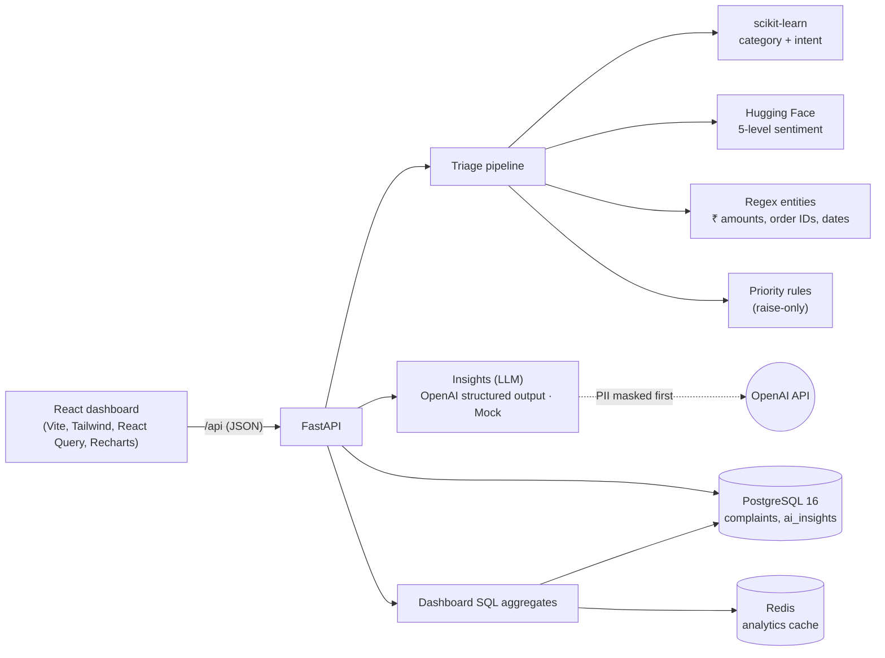
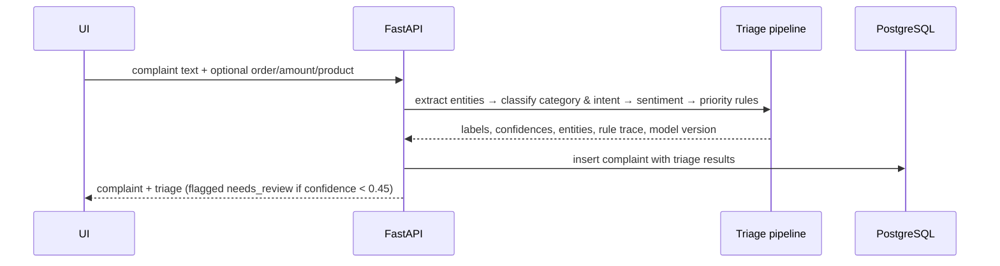

# Architecture

One FastAPI service on async SQLAlchemy 2, PostgreSQL 16 (+ pgvector) and Redis in Docker Compose, one React app.
All AI runs in-process. (This document is rewritten in full as the platform grows; see docs/GAP_REPORT.md.)

## Request flows

**New complaint** — `POST /api/complaints`

**AI insights** — `POST /api/complaints/{id}/insights`: the text is PII-masked, sent with its triage context
to the LLM provider, parsed into the `ComplaintInsight` schema (summary, key issues, recommended actions,
suggested reply) and stored with provider, model and prompt version.

**Dashboard** — `GET /api/dashboard?days=30`: one endpoint computes KPIs (with change vs the previous period),
daily volume and sentiment trends, category / intent / channel / priority breakdowns, open high-priority
complaints, week-over-week emerging issues and plain-English insights, all with SQL `GROUP BY` / `CASE`
aggregates.

## Code layout

| Path | What lives there |
|---|---|
| `backend/app/api/routes.py` | HTTP routes (thin — no queries) |
| `backend/app/services/` | `complaints.py` (create, list, update, insights), `dashboard.py` (analytics SQL) |
| `backend/app/ai/` | `triage.py` orchestrates `classifier.py`, `sentiment.py`, `entities.py`, `priority.py`; `llm.py` + `pii.py` for insights; `keywords.py` domain prior |
| `backend/app/models.py`, `schemas.py` | SQLAlchemy tables and Pydantic request/response shapes |
| `backend/scripts/import_dataset.py` | Loads the Kaggle CSV as historical complaints |
| `ml/` | Dataset profile, classifier training, sentiment validation, reports, model card |
| `frontend/src/pages/` | Dashboard, Complaints list, New complaint, Complaint detail |

## Design decisions

- **AI for language, rules for decisions.** Category, intent and sentiment come from models; priority is a
  documented rule set because the data has no priority labels and the decision must be explainable.
- **Human in the loop.** Low-confidence categories are flagged for review and can be corrected in one click
  (priority is recomputed by the rules). The LLM's reply is a draft that an agent copies — nothing is sent
  automatically.
- **Works offline.** `LLM_PROVIDER=mock` produces realistic insights from the triage results without a key;
  setting `LLM_PROVIDER=openai` and `OPENAI_API_KEY` switches to the real API with structured outputs.
- **PostgreSQL + Alembic.** The schema is versioned with Alembic migrations (`backend/migrations`); the backend
  uses async SQLAlchemy 2 with asyncpg. CPU-bound model inference runs in worker threads off the event loop.
