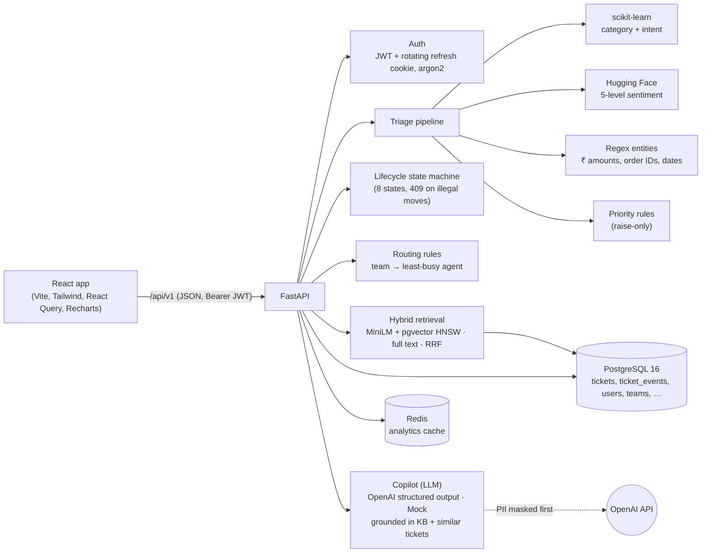
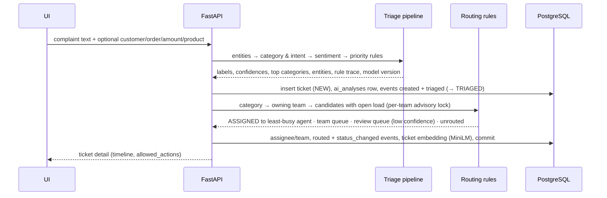

# Architecture

One FastAPI service on async SQLAlchemy 2, PostgreSQL 16 (+ pgvector) and Redis in Docker Compose, one React app.
Triage and routing currently run in-process inside the create request; step 8 of the build moves them to Kafka
workers behind an outbox (see docs/GAP_REPORT.md). This document is rewritten in full as the platform grows.

## Request flows

**New ticket** — `POST /api/v1/tickets` (one transaction)

**Lifecycle actions** — `POST /tickets/{id}/assign|escalate|resolve|close|reopen`, `PATCH /tickets/{id}`: the ticket
row is locked, permissions are checked (Admin vs own/team), the move is checked against
`app/domain/lifecycle.py`, and the change, its `ticket_events` row and (for sensitive actions) its `audit_logs` row
are committed together.

**Retrieval** — `GET /tickets/{id}/similar`, `GET /knowledge/search`: the query is embedded with MiniLM (384 dims);
nearest neighbours come from the pgvector HNSW index (iterative scan, so visibility filters still return enough rows)
and keyword matches from PostgreSQL full text; the two rankings are fused with weighted Reciprocal Rank Fusion
(keywords 0.3, vectors 1.0), weak vector matches are dropped. See ml/reports/retrieval_report.md.

**Copilot** — `POST /api/v1/ai/draft-response`: the most relevant help articles and similar past tickets (within the
caller's visibility) are added as references [A1].., [T1]..; the complaint, conversation and references are
PII-masked (the ticket's own customer becomes [CUSTOMER] and is restored locally in the answer); the LLM returns a
schema (summary, root cause, key issues, next steps, draft reply, references used) that is stored as an
`ai_analyses` row with provider, model, prompt version, token cost and grounding. The draft is posted only when an
agent accepts it (`/ai/drafts/{id}/accept`).

**Analytics** — `GET /api/v1/analytics/overview|trends|categories|emerging` (Admin): SQL `GROUP BY` / `CASE`
aggregates, cached in Redis and invalidated on every write.

## Code layout

| Path | What lives there |
|---|---|
| `backend/app/api/v1/` | HTTP routes (thin — parse, call a service, serialise) |
| `backend/app/domain/` | Pure rules: `lifecycle.py` (states and moves), `routing.py` (team + agent choice) |
| `backend/app/services/` | Business logic: tickets, routing, admin, auth, analytics, attachment storage |
| `backend/app/repositories/` | SQL only (no rules) |
| `backend/app/models/`, `schemas/` | SQLAlchemy tables and Pydantic request/response shapes |
| `backend/app/auth/` | JWT, password hashing, `CurrentUser` / `AdminUser` dependencies |
| `backend/app/ai/` | `triage.py` orchestrates `classifier.py`, `sentiment.py`, `entities.py`, `priority.py`; `llm.py` + `pii.py` for the copilot; `embeddings.py` (MiniLM, hashing fallback) |
| `backend/migrations/` | Alembic migrations (the only way the schema changes) |
| `backend/scripts/` | `prepare_db.py`, `seed.py` (org + users), `import_dataset.py` (history, linked to agents and teams) |
| `ml/` | Dataset profile, classifier training, sentiment validation, reports, model card |
| `frontend/src/pages/` | Dashboard, My work, Ticket queue, Review queue, Create ticket, Ticket details, Login, admin screens |

## Design decisions

- **AI for language, rules for decisions.** Category, intent and sentiment come from models; priority and routing
  are documented rule sets ([PRIORITY_RULES.md](PRIORITY_RULES.md), [ROUTING_RULES.md](ROUTING_RULES.md)) because
  the decisions must be explainable — every ticket stores which rules fired.
- **Human in the loop.** Low-confidence categories are not routed; they wait in the review queue until a person
  confirms or corrects them. The LLM's reply is a draft — nothing is sent automatically.
- **One place for the lifecycle.** Allowed moves are data in `app/domain/lifecycle.py`; the API, the UI's buttons
  (`allowed_actions`) and the tests all derive from it.
- **Works offline.** `LLM_PROVIDER=mock` produces realistic copilot output without a key; `LLM_PROVIDER=openai` and
  `OPENAI_API_KEY` switch to the real API with structured outputs.
- **PostgreSQL + Alembic.** Async SQLAlchemy 2 with asyncpg; CPU-bound model inference runs in worker threads off
  the event loop.
