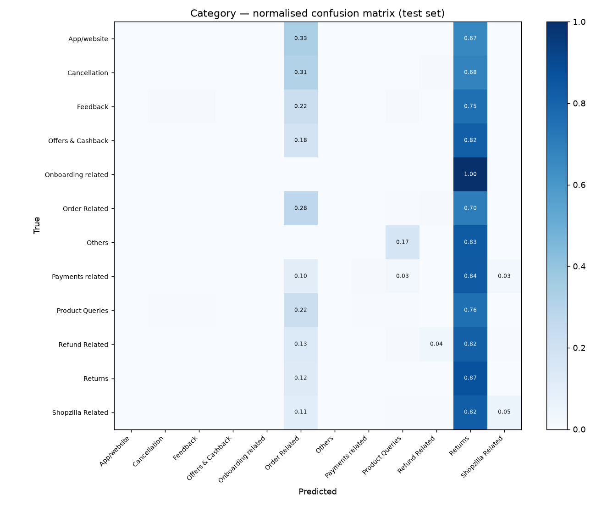

# Classifier evaluation report

Generated 2026-10-03T22:54:48+00:00 by `ml/train_classifiers.py` (seed 42).

Training data: the 28,742 dataset rows that have real `Customer Remarks` (rows with empty remarks are excluded — their descriptions are templated and would leak the label). Split 70/15/15 stratified by category → train 20,119 / validation 4,311 / test 4,312.

## Model selection (validation set)

| task | model | balanced | accuracy | macro_f1 | weighted_f1 |
|---|---|---|---|---|---|
| category | baseline | False | 0.526 | 0.097 | 0.441 |
| category | baseline | True | 0.207 | 0.094 | 0.270 |
| category | text+structured | False | 0.534 | 0.105 | 0.454 |
| category | text+structured | True | 0.222 | 0.102 | 0.285 |
| intent | baseline | False | 0.256 | 0.034 | 0.170 |
| intent | baseline | True | 0.065 | 0.035 | 0.081 |
| intent | text+structured | False | 0.266 | 0.041 | 0.188 |
| intent | text+structured | True | 0.082 | 0.043 | 0.097 |

## Held-out test set

| task | model | accuracy | macro_precision | macro_recall | macro_f1 | weighted_f1 |
|---|---|---|---|---|---|---|
| category | text+structured | 0.529 | 0.200 | 0.105 | 0.102 | 0.448 |
| category | majority class ('Returns') | 0.516 | 0.043 | 0.083 | 0.057 | 0.352 |
| intent | text+structured | 0.274 | 0.115 | 0.039 | 0.040 | 0.194 |
| intent | majority class ('Reverse Pickup Enquiry') | 0.261 | 0.005 | 0.019 | 0.008 | 0.108 |
| category | chosen + keyword prior | 0.502 | 0.171 | 0.105 | 0.105 | 0.440 |

Keyword prior on validation macro-F1: 0.105 without → 0.121 with — **kept**.

## Realistic complaint text (fixed examples)

`ml/data/fixed_complaints.csv` holds 38 hand-written complaints in the style the app receives. Category accuracy: model alone **42%**, model + keyword prior **95%**.

## Per-class results — category (test set)

```
                    precision    recall  f1-score   support

       App/website       0.00      0.00      0.00         3
      Cancellation       0.00      0.00      0.00       108
          Feedback       0.20      0.01      0.02       118
 Offers & Cashback       0.00      0.00      0.00        22
Onboarding related       0.00      0.00      0.00         4
     Order Related       0.42      0.28      0.33      1145
            Others       0.00      0.00      0.00         6
  Payments related       0.33      0.01      0.02       117
   Product Queries       0.06      0.01      0.01       193
    Refund Related       0.33      0.04      0.06       223
           Returns       0.56      0.87      0.68      2226
 Shopzilla Related       0.50      0.05      0.10       147

          accuracy                           0.53      4312
         macro avg       0.20      0.11      0.10      4312
      weighted avg       0.45      0.53      0.45      4312
```



## Per-class results — intent, 15 most frequent classes (test set)

```
                              precision    recall  f1-score   support

      Reverse Pickup Enquiry       0.29      0.78      0.43      1125
              Return request       0.23      0.23      0.23       461
        Order status enquiry       0.19      0.09      0.12       358
                     Delayed       0.26      0.30      0.28       305
           Installation/demo       0.23      0.09      0.13       219
Product Specific Information       0.10      0.03      0.05       187
             Fraudulent User       0.21      0.04      0.07       182
              Refund Enquiry       0.21      0.04      0.06       139
                     Missing       0.07      0.01      0.01       126
                       Wrong       0.18      0.02      0.03       119
    UnProfessional Behaviour       0.12      0.02      0.03       118
             General Enquiry       0.41      0.08      0.14       107
     Service Centres Related       0.20      0.01      0.02        94
                  Not Needed       0.00      0.00      0.00        89
      Seller Cancelled Order       0.53      0.10      0.16        84

                   micro avg       0.27      0.31      0.29      3713
                   macro avg       0.22      0.12      0.12      3713
                weighted avg       0.23      0.31      0.22      3713
```

## Reading these numbers
The only free text in the dataset is the customer's post-contact survey remark (median 3 words; the most common are "good", "thank you", "nice"). Most remarks say nothing about *what* the problem was, so macro-F1 on the dataset is low for every model and the majority-class baseline is shown for reference. The fixed realistic examples show the deployed pipeline on complaint-style text. Low-confidence predictions are flagged `needs_review` in the app instead of being trusted blindly.
