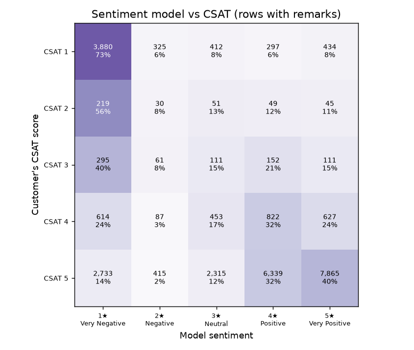

# Sentiment model validation against CSAT

Generated 2026-10-03 23:31 UTC by `ml/eval_sentiment.py`.

Model: `nlptown/bert-base-multilingual-uncased-sentiment` (pretrained, not fine-tuned). Rows: 28,742 remarks; inference 1868s on CPU (15 texts/s).

## Agreement with CSAT

| Metric | Value |
|---|---|
| Exact match (stars = CSAT) | 44.2% |
| Within ±1 star | 72.8% |
| Spearman correlation (expected stars vs CSAT) | 0.520 |
| Dissatisfied detection (CSAT ≤ 2 vs predicted ≤ 2): precision / recall / F1 | 0.514 / 0.776 / 0.619 |
| Reference: always predicting the most common CSAT | 68.4% exact |

## Mean CSAT by predicted sentiment

| Predicted sentiment | Rows | Mean CSAT |
|---|---|---|
| Very Negative | 7,741 | 2.75 |
| Negative | 918 | 3.26 |
| Neutral | 3,342 | 4.26 |
| Positive | 7,659 | 4.68 |
| Very Positive | 9,082 | 4.70 |

## Notes

- CSAT rates the whole support interaction while the model reads only the remark text, so perfect agreement is not expected; a monotonic rise in mean CSAT across predicted levels is the main validity check.

- Remarks are very short; one-word remarks such as "ok" are inherently ambiguous.

- Predictions are saved to `ml/artifacts/sentiment_predictions.csv` and reused by the dataset importer.
